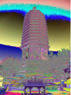
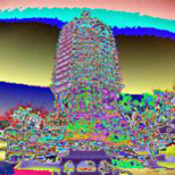
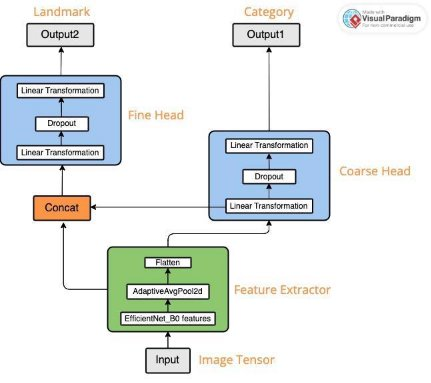

**DSCI 552 Final Project Report** 

**Group #20 with members: Zixin Shen, Yixin Zhang, Ziyu Chen** 

**Landmark category and name multi-class  classification on a small dataset** 

**Abstract** 

In this project, we present a multi-class deep learning model for landmark recognition, focusing on category classification and landmark name prediction tasks. The model is based on a modified EfficientNet-B0 architecture, incorporating a coarse head for category classification and a fine head for landmark name prediction. We employed various image augmentation techniques using the Albumentations library to enhance the model's learning capabilities, including pixel-level and spatial-level transformations. The model's performance was evaluated using a small dataset's F1 scores and loss metrics. 

We obtained a train F1 score of 0.9547 and a validation F1 score of 0.6965 for category classification;  a train F1 score of 0.85  and a validation F1 score of 0.55.  On the Vocareum grading platform, we got an F1 score of 0.6207 for landmark prediction and an F1 score of 0.9546 for category prediction. Our results demonstrate that the model achieves  high  performance  in  the  training  dataset;  however,  its  generalization performance on the validation dataset is relatively poor, which can be attributed to the limited  dataset  size. The  name  prediction  task  proved  more  challenging  than  the category  classification  task.  In  conclusion,  the proposed  model  shows  promise  in landmark recognition tasks, but further work is needed to improve its generalization performance and robustness. This could involve expanding the dataset size, exploring more  advanced  data  augmentation  techniques,  and  investigating  alternative  model architectures or fine-tuning strategies. 

**Introduction** 

Datasets in this project include 6 categories: Gothic, Modern, Mughal, Neoclassical, Pagodas, and Pyramids. Each category is composed of 5 landmarks and 14 images for each landmark. The task is category classification, predicting the style of the image, and landmark classification, predicting the name of the image. Li stated in their article that the validation sets would be small due to the hand-labeling of the dataset (Li et al. 1). In a similar situation here, the small validation and test dataset leads to our difficulty that convolutional neural networks (CNNs) trained from scratch will overfit the data. In Li’s article, they solve this difficulty by employing a much larger dataset, which includes 2 million labeled images with 500 categories. However, the dataset provided in our research, indicates that finding a new way to overcome this difficulty is necessary. In this research, data augmentation, using pre-trained CNN, and combing the models 

for the two tasks are methods used to solve the difficulty of small datasets. 

**Data Preprocessing**

We mainly use Albumentation as an image augmentation tool. Alexander Buslaev and Vladimir I. Iglovikov mention in their article *Albumentations: Fast and Flexible Image Augmentations*, Albumentation provides an efficient way for image augmentation to increase the diversity and size of the existing training sets (Buslaev et al. 1). We employ both pixel-level transforms and Spatial-level transforms. In Pixel-level transforms, we use Blur, RandomBrightnessContrast, which would change an input image. Some other things like key points and masks would not change. We use Blur with maximize kernel size 3 and probability 0.2. In Spatial-level transforms, we use HorizontalFlip, rotate, normalization, and resizing, which change the input image and additional target, like key  points  and  masks  as  mentioned  in  Albumentations  documentation.  Using normalization and resizing as methods of augmentation, we processd the data. The mean and standard deviation is using Landmarks-v1\_1 total pixels of data divided by the number of pixels and the standard deviation is using corresponding calculation.**  Example of image transforms: 

|

Figure 1: Image 1 Before Image Augmentation 
|

Figure 2: Figure 1 After normalization 
|
| - | - |
|

Figure 3: Figure After all Image Augmentations 
|

Figure 2: After RandomBrightnessContrast 
|

Beside Data augmentation, this research also uses stratifiedKFold to split data into train and test sets. With stratified random sampling, the algorithm will generate test sets that all sets contain the same distribution of classes. StratifiedKFold is a method for cross- validation, which prevents overfitting. As mentioned in *Cross-Validation*, Daniel Berrar states that this kind of cross-validation estimates the performance of the built model on new data (Berrar 6). 

**Methods** 

Our overall model is built using the PyTorch Lightning framework for efficient training and evaluation. We defined two classes LitModule and EffNet\_B0 which together form a multi-class learning architecture using the EfficientNet-B0 as a base model. The whole design is shown in the following graph. 

The base model Effnet\_B0 is built upon the EfficientNet-B0 architecture, which is a convolutional neural  network (CNN) designed for image classification tasks (Tan, 2019). We defined two separate class heads called coarse\_head and fine\_head within the model for predicting coarse (style) and fine (landmark) classes. The output vectors of these two class heads will be passed to a Softmax function. The category is therefore chosen according to the maximum value generated by the function. 

Firstly, we applied a *Feature extractor* onto the input image by passes through the EfficientNet-B0 layers, which extract high-level features from the image. The output features will be passed to the two heads for next steps. 

The *coarse\_head* class is responsible for performing coarse-grained classification. It 

usually deals with broader, more general categories or classes. In our model, this class will  eventually  classify  the  input  features  into  one  of  the  style  categories.  We constructed *coarse\_head* as a Sequential container with a Linear Layer followed by a Dropout layer and another Linear layer. We added this Dropout layer, a regularization technique, to prevent overfitting. Additionally, we deliberately chose to pass the output given by the first fully connected layer to concatenate to the *fine\_head* inside the *forward* method, so that this output will not be affected by the Dropout layer in the coarse head. By this design, we avoid information loss when passing to concatenate. The *fine\_head* class is responsible for performing fine-grained classification. It deals with  more  specific,  detailed  categories  or  subclasses  within  the  broader  classes identified by the coarse head. In our model, this class will classify the input features into actual landmark names. In our code, we constructed *fine\_head* as a Sequential container with a Linear Layer followed by a Dropout layer and another Linear layer. Inside the *forward* method of EffNet\_B0 class, we first pass the input tensor through the feature extractor, which consists of the EfficientNet-B0 backbone followed by adaptive average pooling and flattening. Next, we pass the output of the features through the first linear layer of the *coarse\_head* sequence and store it in the output of the hidden layer, which contains the output of the first fully connected layer with 512 units. After that, we pass the output of the features through the entire *coarse\_head* sequence and store it in the coarse variable which then contains the information that can lead to the actual coarse classification. 

We then concatenate the output of the features and the output of the first fully connected layer  in  the  *coarse\_head*  sequence  along  the  last  dimension.  Next,  we  pass  the concatenated  tensor  through  the  *fine\_head*  sequence  to  obtain  the  fine  output representing the fine classification. We now have a complex model where the fine classification branch receives both the output of the EfficientNet-B0 features and the output of the first fully connected layer of the coarse classification branch. 

Our model uses CrossEntropyLoss for both the coarse and fine tasks to calculate the loss for each task separately. We use the default setting given by *Optimizer and* StepLR which configures an AdamW optimizer with a learning rate scheduler (StepLR) to adjust the learning rate during training. This class calculates the macro F1 score for both tasks using the ground truth labels and the model's predictions.  

Combining the EffNet\_B0 and LitModule classes, we obtained a multi-class learning model that predicts the input images' coarse (style) and fine (landmark) classes. 

**Results** 

We  evaluate  the  performance  of  the  landmark  name  prediction  and  category classification in terms of F1 score and loss shown in the table below. 

|**Train** |**F1** |**Loss** |**Validation** |**F1** |**Loss** |
| - | - | - | - | - | - |
|**Coarse** |**0.9547** |**0.1701** |**Coarse** |**0.6965** |**0.1237** |
|**Fine** |**0.85** |**0.5259** |**Fine** |**0.55** |**0.6751** |

Compared to the high F1 in the training dataset, the F1 validation dataset is low, 

indicating that the generalization performance of this model is relatively poor. The loss of the training dataset for category classification is 0.1701; in the validation set, the loss is 0.1237. These two losses are close to 0, indicating the model is neither overfitting nor underfitting. 

According to the attached additional images, the overall trending of the F1 score in the train and validation datasets is increasing. Also, for the validation dataset, the loss decreases until close to 0. However, in the train coarse F1 graph and loss graph, the curves are largely fluctuating. According to Brendano, the fluctuation of accuracy may be caused by a large network and a small dataset.  

In the name prediction part, the train F1 score is 0.85 and the validation F1 score is 0.55. These two F1 scores follow the same pattern as those for category classification, pointing out the same problem in small datasets. Besides, compared to the F1 scores for category classification, those for the name prediction are lower.  

Additionally, for name prediction, the F1 score in  training and validation datasets increasing overall, but they cannot achieve a high score. The losses of training and validation  are  going  down.  Since  name  prediction  and  category  classification  are completed in one model in this research, overall F1 scores and losses are calculated. The overall F1 score in the training dataset is 0.9033 and the overall loss is 0.348. The total F1 score in the validation dataset is 0.6233 and the loss is 0.3994. The F1 score difference between the training and validation dataset follows the same pattern as in a specific task. 

**Conclusion** 

Overall, the model shows promise in its ability to perform landmark recognition tasks. However, to improve its generalization performance and robustness, it is recommended that future work should focus on expanding the dataset size, exploring more advanced data augmentation techniques, and investigating other model architectures or fine- tuning strategies. This would help address the limitations identified in this study and further  enhance  the  model's  performance  in  landmark  category  classification  and landmark name prediction tasks. 

**Bibliography** 

Buslaev, A.; Iglovikov, V.I.; Khvedchenya, E.; Parinov, A.; Druzhinin, M.; Kalinin, A.A. Albumentations: Fast and Flexible Image Augmentations. *Information* **2020**, *11*, 125.  Yunpeng Li, D. J. Crandall and D. P. Huttenlocher, "Landmark classification in large- scale  image  collections," *2009  IEEE  12th  International  Conference  on  Computer Vision*, Kyoto, Japan, 2009, pp. 1957-1964, doi: 10.1109/ICCV.2009.5459432. 

Berrar, Daniel. "Cross-Validation." (2019): 542-545. 

Tan,  Mingxing,  and  Quoc  V.  Le.  "EfficientNet:  Rethinking  Model  Scaling  for Convolutional Neural Networks."*arXiv preprint arXiv:1905.11946* (2019). Retrieved from[` `**https://arxiv.org/abs/1905.11946** ](https://arxiv.org/abs/1905.11946)

Tan,  Mingxing,  and  Quoc  V.  Le.  "EfficientNet:  Rethinking  Model  Scaling  for Convolutional Neural Networks."*arXiv preprint arXiv:1905.11946* (2019). Retrieved from[` `**https://arxiv.org/abs/1905.11946** ](https://arxiv.org/abs/1905.11946)
